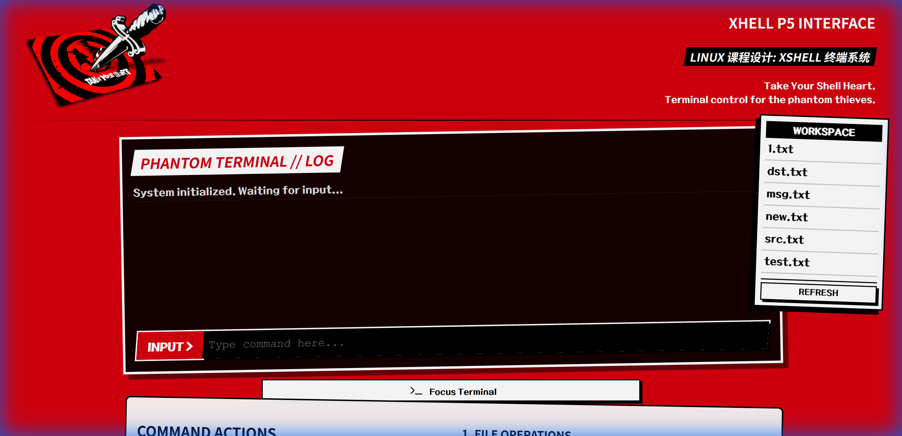
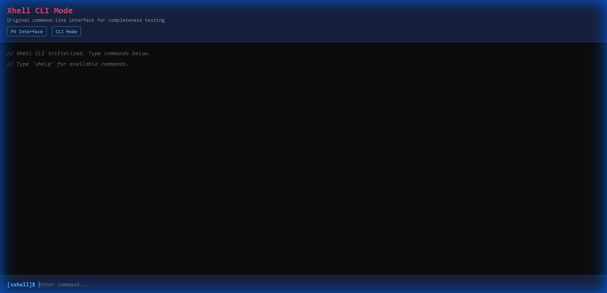
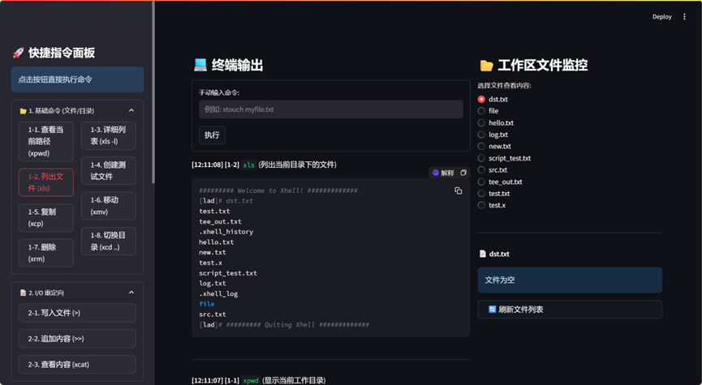
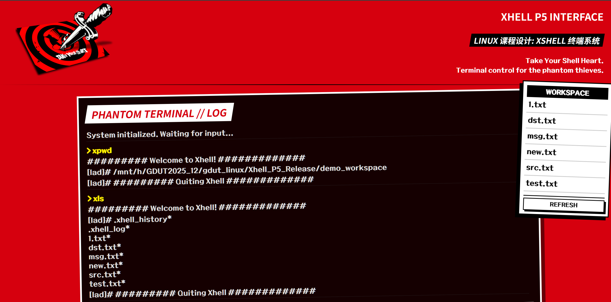
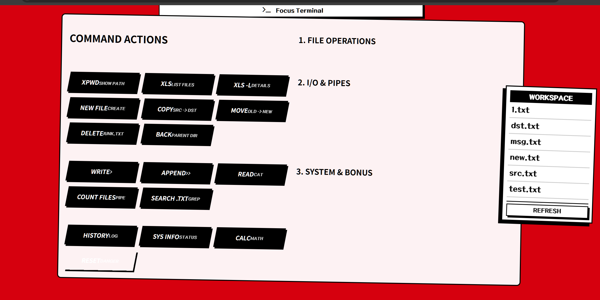
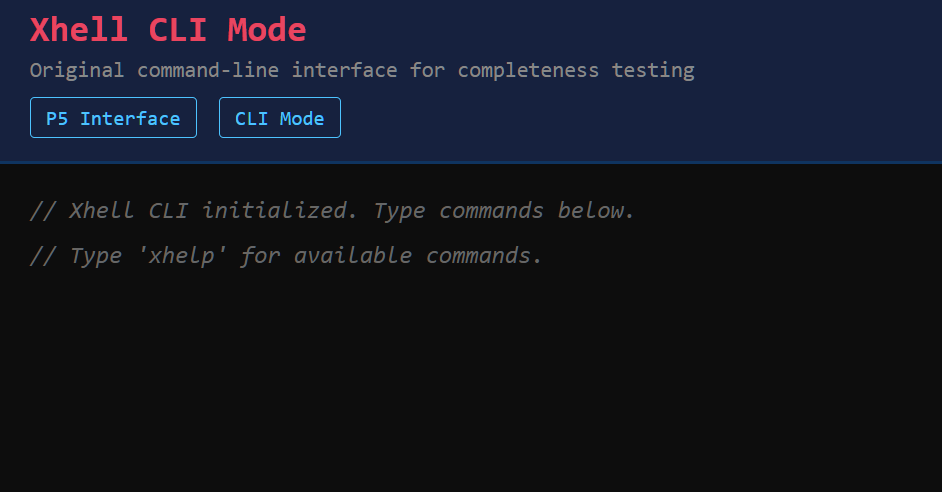

# XShell - 类 Unix Shell 实现

一个用 C 语言编写的类 Unix Shell，支持管道、I/O 重定向、内置命令，并配备现代化的 Flask Web 演示界面。

## 运行截图

### P5 主题界面（最终版本）


### CLI 测试界面


### Streamlit 界面（v1 版本）





## 核心特性

### Shell 基础功能
- **多级管道**：通过 `|` 连接命令（如 `cmd1 | cmd2 | cmd3`）
- **I/O 重定向**：支持 `<`、`>`、`>>` 和 `2>` 操作符
- **内置命令**：18+ 内置命令，涵盖文件操作、系统工具
- **外部程序执行**：通过 `fork()` + `execv()` 调用系统程序
- **命令历史**：持久化历史记录，跨会话保存

### 进阶特性
- **xsearch**：内置文本搜索工具（类似 grep）
- **xcalc**：命令行计算器，支持四则运算
- **xsh**：脚本解释器，执行 `.x` 脚本文件
- **xsysinfo**：系统资源监控
- **彩色输出**：`xls` 支持 ANSI 彩色显示

### 现代化 UI
- **P5 主题 Web 界面**：Persona 5 风格的交互式网页终端
- **CLI 测试模式**：简约暗色命令行界面
- **一键演示**：预配置的演示按钮
- **实时输出**：命令执行可视化
- **文件工作区**：集成文件浏览器

## 安装使用

### 环境要求
```bash
# Linux/Unix 系统 (推荐 WSL)
gcc make python3 pip
```

### 编译运行
```bash
# 克隆项目
git clone https://github.com/AsakaTigar/unix-shell-xhell.git
cd unix-shell-xhell

# 编译 Shell
cd p5_interface/xhell
make
./xhell
```

### 启动 Web 界面（最终版本）
```bash
cd p5_interface
./start.sh

# 浏览器访问:
# P5 主题界面: http://localhost:8505
# CLI 测试界面: http://localhost:8505/cli
```

### 启动 Streamlit 界面（v1 版本）
```bash
cd streamlit_demo
pip install streamlit
streamlit run app.py

# 浏览器访问 http://localhost:8501
```

## 使用示例

### 交互模式
```bash
$ ./xhell
[xshell]# xls -l          # 列出文件详细信息
[xshell]# xpwd            # 显示当前目录
[xshell]# xcat file.txt   # 查看文件内容
[xshell]# quit            # 退出 Shell
```

### 管道操作
```bash
# 统计目录文件数
xls | wc -l

# 在输出中搜索
xls -l | xsearch .txt

# 链式搜索
xcat log.txt | xsearch ERROR | wc -l
```

### 重定向操作
```bash
# 输出重定向
xecho "Hello World" > output.txt

# 追加模式
xecho "新内容" >> output.txt

# 输入重定向
xcat < input.txt

# 错误重定向
xcp nonexist.txt dst.txt 2> error.log
```

### 内置命令表
| 命令 | 说明 |
|------|------|
| `xpwd` | 显示当前工作目录 |
| `xcd [dir]` | 切换目录 |
| `xls [-l] [dir]` | 列出目录内容（彩色） |
| `xtouch <file>` | 创建空文件 |
| `xcat <file>` | 显示文件内容 |
| `xcp [-r] <src> <dst>` | 复制文件/目录 |
| `xmv <src> <dst>` | 移动/重命名文件 |
| `xrm [-r] <path>` | 删除文件/目录 |
| `xecho [text]` | 输出文本 |
| `xsearch <term> [file]` | 文本搜索（支持管道） |
| `xcalc <n1> <op> <n2>` | 计算算术表达式 |
| `xsh <script.x>` | 执行脚本 |
| `xhistory` | 查看命令历史 |
| `xsysinfo` | 显示系统信息 |
| `xhelp` | 显示所有命令 |

## 系统架构

```
┌─────────────────────────────────────────┐
│         用户输入 (CLI/Web)              │
└──────────────────┬──────────────────────┘
                   │
                   ▼
         ┌─────────────────┐
         │  解析器模块     │
         │  (parser.c)     │
         └────────┬────────┘
                  │
                  ▼
         ┌────────────────────┐
         │  管道数据结构      │
         └────────┬───────────┘
                  │
                  ▼
    ┌─────────────────────────────┐
    │   执行器 (pipe.c)           │
    │   - fork() 创建子进程       │
    │   - pipe() 进程间通信       │
    │   - dup2() 重定向           │
    └──────────┬──────────────────┘
               │
       ┌───────┴────────┐
       ▼                ▼
┌─────────────┐   ┌────────────────┐
│  内置命令   │   │   外部程序     │
│(builtins.c) │   │(external_exec.c)│
└─────────────┘   └────────────────┘
```

## 项目结构

```
xshell/
├── p5_interface/           # 最终版本 - Flask + P5 主题
│   ├── app.py             # Flask 后端
│   ├── xhell_wrapper.py   # Shell 调用封装
│   ├── templates/         # HTML 模板
│   │   ├── index.html     # P5 主题界面
│   │   └── cli.html       # CLI 测试界面
│   ├── static/            # CSS + 资源文件
│   ├── xhell/             # C 核心代码
│   └── start.sh           # 一键启动脚本
├── streamlit_demo/         # v1 版本 - Streamlit 界面
│   ├── app.py
│   └── xhell_wrapper.py
├── xhell/                  # C 核心实现
│   ├── src/
│   │   ├── main.c         # REPL 主循环
│   │   ├── parser.c       # 命令解析
│   │   ├── pipe.c         # 管道执行
│   │   ├── builtin_commands.c  # 内置命令
│   │   ├── redirection.c  # 重定向处理
│   │   ├── external_exec.c     # 外部程序
│   │   ├── utils.c        # 工具函数
│   │   └── logger.c       # 日志系统
│   ├── include/
│   │   └── xhell.h
│   └── Makefile
├── docs/images/            # 运行截图
└── README.md
```

## 技术亮点

1. **进程管理**：健壮的 `fork()`/`execv()`/`waitpid()` 实现
2. **管道通信**：多级管道与文件描述符管理
3. **资源安全**：自动回收僵尸进程和文件描述符
4. **ANSI 彩色**：终端输出增强
5. **错误处理**：完善的 `perror()` 和状态码管理

## 开源协议

MIT License - **欢迎用于学习和开发**

## 致谢

本项目作为 Unix 系统编程的学习示例，涵盖以下核心概念：
- 进程创建与管理
- 进程间通信
- 文件 I/O 与系统调用
- 信号处理
- POSIX API 使用

---

**注意**：这是一个教学项目。生产环境建议使用 Bash、Zsh 或 Fish 等成熟 Shell。
