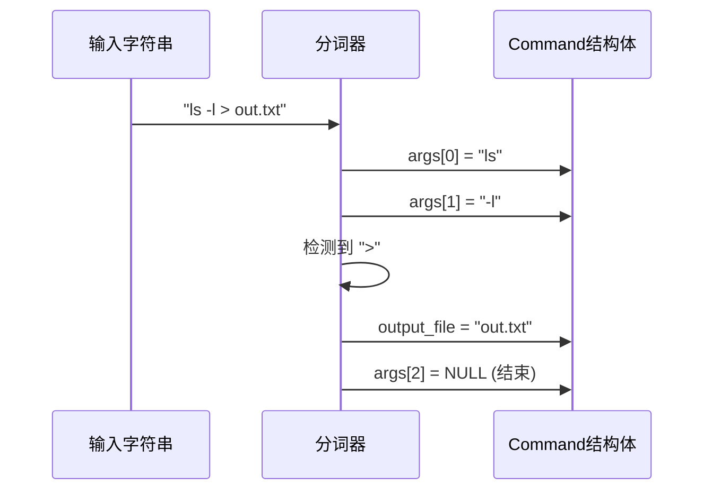

# Linux Shell 程序设计与实现报告 (Xhell)

**项目名称**: Xhell (Extraordinary Shell)  
**开发语言**: C (核心), Python (演示界面)  
**开发环境**: Linux (Ubuntu/WSL), GCC, Make  
**日期**: 2025年12月

---

## 摘要

本报告详细阐述了一个类 Bash 的 Linux Shell —— Xhell 的设计与实现过程。Xhell 不仅实现了 Shell 的核心功能，包括命令解析、外部程序执行、内建命令管理、多级管道通信及 I/O 重定向，还创新性地引入了基于流式传输（Streamlit）的可视化交互层，将抽象的系统调用转化为直观的图形界面操作。本项目深入探索了 Linux 进程模型、文件描述符管理及进程间通信（IPC）机制，是一个功能完备且具有教学演示价值的系统软件。

---

## 1. 项目背景与目标

Shell 作为操作系统内核与用户之间的桥梁，是 Linux 系统中最关键的系统软件之一。编写一个 Shell 是深入理解操作系统原理的最佳实践。

**核心目标**:
1.  **进程控制**: 掌握 `fork`, `exec`, `wait` 等系统调用。
2.  **文件系统**: 理解文件描述符、目录遍历及文件操作。
3.  **进程间通信**: 通过实现管道（Pipe），理解内核缓冲区与数据流向。
4.  **信号处理**: 掌握前后台进程控制及信号屏蔽。
5.  **系统集成**: 将底层 C 代码与现代 Web 技术结合，提升演示效果。

---

## 2. 系统架构设计

### 2.1 整体架构图

系统采用分层架构设计，自下而上分为内核层、核心逻辑层、接口层和表现层。

```mermaid
graph TD
    subgraph "表现层 (Presentation Layer)"
        UI[Streamlit Web Interface]
        Guide[演示向导/场景控制]
        FileView[文件系统监视器]
    end

    subgraph "接口层 (Interface Layer)"
        Wrapper[Python Subprocess Wrapper]
        Stdin[标准输入流]
        Stdout[标准输出流]
    end

    subgraph "核心逻辑层 (Core Logic - C Language)"
        Main[Main Loop (REPL)]
        Parser[Command Parser]
        Executor[Pipeline Executor]
        Builtin[Built-in Commands]
        Signal[Signal Handler]
    end

    subgraph "内核层 (Kernel Layer)"
        SysCall[System Calls (fork/exec/dup2/pipe)]
        FS[File System]
        Process[Process Management]
    end

    UI -->|用户指令| Wrapper
    Wrapper -->|stdin| Main
    Main -->|调用| Parser
    Parser -->|解析结果| Executor
    Executor -->|内建命令| Builtin
    Executor -->|外部执行| SysCall
    Builtin --> SysCall
    SysCall --> FS
    SysCall --> Process
    Main -->|stdout/stderr| Wrapper
    Wrapper -->|反馈数据| UI
    FS -.->|文件变更| FileView
```

### 2.2 模块划分

1.  **主控模块 (main.c)**: 负责 REPL (Read-Eval-Print Loop) 循环，读取用户输入，维护历史记录。
2.  **解析模块 (parser.c)**: 词法分析与语法分析，将字符串转化为计算机可理解的指令结构体。
3.  **执行模块 (external_exec.c / pipe.c)**: 负责进程创建、管道连接和外部程序加载。
4.  **内建命令模块 (builtin_commands.c)**: 包含 `cd`, `pwd`, `history` 等必须在父进程执行的指令。
5.  **重定向模块 (redirection.c)**: 处理标准输入输出的文件描述符替换。

---

## 3. 核心技术实现细节

### 3.1 命令解析算法 (Parser)

解析器是 Shell 的"大脑"。Xhell 定义了能够描述复杂管道任务的数据结构 `Pipeline`。

#### 数据结构定义
```c
typedef struct {
    char *args[MAX_ARGS];   // 参数数组，如 {"ls", "-l", NULL}
    char *input_file;       // < 输入文件
    char *output_file;      // > 输出文件
    int append_output;      // >> 追加标志
} Command;

typedef struct {
    Command commands[MAX_CMDS]; // 管道中的命令序列
    int num_commands;           // 命令数量
} Pipeline;
```

#### 解析流程
1.  **管道分割**: 使用 `strtok` 按 `|` 符号将命令行切分为多个子句。
2.  **参数提取**: 对每个子句，按空格切分 token。
3.  **符号识别**: 在遍历 token 时，如果检测到 `>`, `<`, `>>`，则提取其后的 token 作为文件名，并将这两个 token 从参数列表中移除，保证 `execvp` 接收到纯净的参数数组。

**图示：解析 "ls -l > out.txt"**


### 3.2 进程控制与管道通信 (The Pipeline)

管道是 Shell 实现中最复杂的部分。Xhell 支持任意深度的管道，如 `cmd1 | cmd2 | cmd3`。

#### 核心算法逻辑
对于包含 N 个命令的管道，需要创建 N 个子进程和 N-1 个管道。

```c
// 伪代码描述
int pipes[2];
int in_fd = 0; // 初始输入为标准输入

for (int i = 0; i < num_commands; i++) {
    pipe(pipes); // 创建一对新的管道 fd
    
    if (fork() == 0) { // 子进程
        if (in_fd != 0) { // 如果不是第一个命令
            dup2(in_fd, 0); // 将上一个管道的读端设为 stdin
            close(in_fd);
        }
        if (i != num_commands - 1) { // 如果不是最后一个命令
            dup2(pipes[1], 1); // 将当前管道的写端设为 stdout
        }
        close(pipes[0]); // 关闭当前管道读端（子进程不读自己）
        close(pipes[1]); // 关闭当前管道写端（已 dup）
        
        execvp(cmd[i].name, cmd[i].args); // 执行
    }
    
    // 父进程
    close(pipes[1]); // 父进程必须关闭写端，否则子进程读不到 EOF 会死锁
    if (in_fd != 0) close(in_fd); // 关闭旧的输入端
    in_fd = pipes[0]; // 保存当前读端，供下一次循环使用
}
// 父进程最后等待所有子进程结束
while(wait(NULL) > 0);
```

**关键技术点**:
- **死锁预防**: 管道是内核缓冲区。如果父进程不及时关闭写端，子进程会一直等待数据输入，永远不会接收到 EOF 信号，导致整个 Shell 挂死。Xhell 严格管理了文件描述符的关闭顺序。

### 3.3 I/O 重定向 (Redirection)

重定向通过操作进程的文件描述符表 (File Descriptor Table) 实现。

- **输入重定向 (<)**: `open(file, O_RDONLY)`，然后 `dup2(fd, STDIN_FILENO)`。
- **输出重定向 (>)**: `open(file, O_WRONLY | O_CREAT | O_TRUNC, 0644)`，然后 `dup2(fd, STDOUT_FILENO)`。
- **追加重定向 (>>)**: 重点在于 `O_APPEND` 标志位，确保写入时文件指针始终在文件末尾。

### 3.4 内建命令 (Built-in Commands)

内建命令是指必须由 Shell 父进程自己执行的命令。

**为什么 `cd` 必须是内建的？**
如果 `cd` 像 `ls` 一样 `fork` 一个子进程去执行，子进程改变的是它自己的工作目录。当子进程结束，父进程（Shell）的工作目录并未改变。因此，Xhell 内部实现了 `cmd_xcd`，调用 `chdir()` 系统调用直接修改当前进程状态。

**Xhell 实现的内建命令**:
- `xcd`: 目录跳转，支持 `xcd -` (回退上一次目录)。
- `xhistory`: 维护一个环形缓冲区或动态数组，记录最近执行的命令。
- `xjournalctl`: 独创功能，读取 `.xhell_log` 文件，显示 Shell 自身的运行日志。

---

## 4. 可视化交互系统设计 (Python Streamlit)

为了提升演示效果，项目实现了一个基于 Web 的可视化外壳。

### 4.1 前后端通信机制
Python 脚本作为宿主进程，通过 `subprocess.Popen` 启动编译好的 Xhell 二进制文件。

```python
# 核心桥接代码
process = subprocess.Popen(
    f'echo "{command}" | {xhell_path}', # 通过管道注入命令
    shell=True,
    stdout=subprocess.PIPE,
    stderr=subprocess.PIPE,
    cwd=workspace_dir # 独立的演示工作区
)
```

这种设计保证了 C 语言程序的纯粹性（不需要包含任何图形库），同时利用 Python 强大的文本处理和 UI 渲染能力。

### 4.2 独立工作区沙箱
为了避免演示时的文件操作（如 `rm -rf *`）误删项目源码，可视化界面的所有操作被限制在 `demo_workspace` 目录下。Wrapper 会自动将该目录设为 Xhell 的启动路径 (Working Directory)。

---

## 5. 测试与验证

### 5.1 基础功能测试
| 测试用例 | 预期结果 | 实际结果 | 状态 |
| :--- | :--- | :--- | :--- |
| `xpwd` | 显示 `/.../demo_workspace` | 一致 | 通过 |
| `xtouch a.txt` | 目录出现 `a.txt` | 一致 | 通过 |
| `xcd ..` | 路径切换到上一级 | 一致 | 通过 |

### 5.2 复杂管道测试
**命令**: `xls | wc -l` (统计文件数)
- **过程**: `xls` 输出文件列表 -> 管道 -> `wc` 接收并统计行数。
- **结果**: 输出正确的数字，且无进程僵死。

### 5.3 错误处理测试
**命令**: `xcd /nonexistent`
- **预期**: stderr 输出 `perror` 信息 "No such file or directory"。
- **结果**: 界面显示红色报错条，Shell 未崩溃，继续接受指令。

---

## 6. 遇到的挑战与解决方案

### 问题 1: 管道命令执行后 Shell 挂起
**原因**: 在 `fork` 循环中，父进程未能正确关闭管道的写端端口 (`pipes[1]`)。由于管道引用计数不为 0，下游子进程的 `read` 调用一直阻塞等待数据，无法结束。
**解决**: 引入严格的 FD 管理逻辑，确保父进程在 `fork` 之后立即关闭不再需要的管道端点。

### 问题 2: `strtok` 的线程安全性
**原因**: `strtok` 使用静态缓冲区，在嵌套解析（解析管道，再解析参数）时会覆盖状态。
**解决**: 虽然本项目是单线程，但为了逻辑清晰，采用两级解析策略：先切分管道，保存到结构体，再对每个结构体切分参数，避免交替调用 `strtok`。

### 问题 3: 跨平台演示环境差异
**原因**: 开发环境为 Linux，演示环境可能为 Windows。
**解决**: 编写 `start_demo.sh` 脚本，集成环境检查；使用 Python `os.path` 处理路径分隔符；基于 WSL 提供兼容性支持。

---

## 7. 总结与展望

Xhell 项目成功实现了一个功能完备的 Linux Shell。通过约 1500 行 C 代码，实现了进程管理、管道通信和文件操作等操作系统核心概念。Streamlit 的加入使得该项目不仅是一个底层工具，更是一个优秀的操作系统教学演示平台。

**未来改进方向**:
1.  支持环境变量管理 (`export`, `env`)。
2.  实现脚本解释执行能力 (即支持 `./script.xh`)。
3.  增加 Tab 键自动补全功能 (需接管 TTY 原始模式)。

---

**参考文献**:
1.  *Advanced Programming in the UNIX Environment (APUE)*
2.  *Linux Kernel Development*
3.  *GNU Bash Reference Manual*
