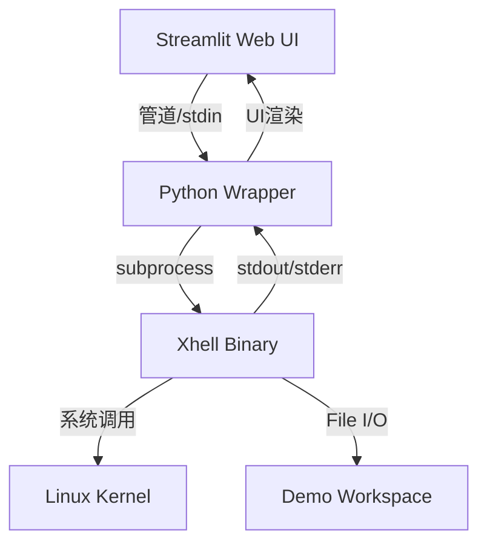

# Xhell 项目技术实现总结

本文档详细总结了 Xhell 项目的技术路线、架构设计及核心实现细节，用于撰写课程设计报告或技术文档。

## 1. 项目整体架构

项目采用 **前后端分离** 的设计思想（逻辑上分离）：
- **后端 (Core)**: 使用 C 语言编写的核心 Shell 逻辑 (`xhell`)，负责解析命令、管理进程、处理 I/O。
- **前端 (UI)**: 使用 Python (Streamlit) 编写的可视化操作界面，通过子进程管道与后端交互。

## 2. 核心 C 语言实现 (Xhell)

### 2.1 数据结构设计 (`xhell.h`)
- **Command 结构体**: 抽象单个命令。包含参数数组 (`args`)、输入/输出/错误重定向文件路径、追加模式标志 (`append_output`)。
- **Pipeline 结构体**: 抽象管道任务。包含 `Command` 数组和命令计数，支持多级管道（如 `cmd1 | cmd2 | cmd3`）。

### 2.2 核心模块实现

#### A. 解析器模块 (`parser.c`)
- **功能**: 将原始字符串解析为 `Pipeline` 结构。
- **技术**: 
  - 使用 `strtok` 切分管道符号 `|`。
  - 对每个子命令进行空格切分，解析参数。
  - **重定向解析**: 遍历参数检测 `>`, `>>`, `<` 等符号，提取文件名并从参数列表中移除这些符号，确保 `execvp` 接收纯净参数。

#### B. 进程控制与管道 (`pipe.c`, `external_exec.c`)
- **单命令执行**: 
  - `fork()` 创建子进程。
  - `execvp()` 加载外部程序（自动利用 `$PATH` 环境变量）。
  - `waitpid()` 等待子进程结束并获取状态码。
- **管道实现**:
  - 利用 `pipe()` 创建匿名管道。
  - 在循环中 `fork` 子进程，利用 `dup2()` 将上一个命令的 `stdout` 接入当前命令的 `stdin`。
  - 父进程负责关闭不再使用的文件描述符，防止死锁。

#### C. I/O 重定向 (`redirection.c`)
- **标准输出/错误**: 使用 `open()` 打开目标文件。
  - 覆盖模式 (`>`): `O_WRONLY | O_CREAT | O_TRUNC`
  - 追加模式 (`>>`): `O_WRONLY | O_CREAT | O_APPEND`
- **实现**: 使用 `dup2(fd, STDOUT_FILENO)` 替换进程的标准输出流。

#### D. 内置命令 (`builtin_commands.c`)
实现了 13 个内置指令，直接调用 POSIX API 而非创建新进程：
| 命令 | 对应系统调用/逻辑 |
| :--- | :--- |
| `xcd` | `chdir()`，支持 `-` 回退（利用全局变量 `prev_dir`） |
| `xpwd` | `getcwd()` |
| `xls` | `opendir()`, `readdir()`, `stat()` (获取文件类型/时间) |
| `xtouch`| `open()` with `O_CREAT` + `utime()` (更新时间戳) |
| `xcp` | 自定义文件复制逻辑，支持目录递归 (`stat` 判断类型) |
| `xhistory`| 读取内存中的历史记录数组 |

## 3. Python 可视化层 (Streamlit Demo)

### 3.1 桥接层 (`xhell_wrapper.py`)
- **封装**: `subprocess.Popen` 调用编译好的 `xhell` 二进制文件。
- **隔离性**: 强制指定 `cwd` (当前工作目录) 为 `demo_workspace`，确保演示操作不污染代码库。
- **交互**: 通过 `echo "cmd" | ./xhell` 的方式模拟用户输入，捕获 `stdout` 和 `stderr` 返回给前端。

### 3.2 界面交互 (`app.py`)
- **状态管理**: 使用 `st.session_state` 维护命令历史、当前路径。
- **一键演示**: 预置命令列表（如“基础命令”、“管道演示”），点击按钮即可自动填入并执行脚本。
- **文件观察器**: 实时扫描 `demo_workspace` 目录，前端直接展示文件内容变化，直观验证 `touch`, `cp`, `echo > file` 等命令的效果。

## 4. 技术难点与解决

1. **管道死锁问题**: 
   - **现象**: 父进程未关闭管道写端，导致子进程 `read` 永远阻塞。
   - **解决**: 严格的 `close()` 顺序，确保父进程在 `fork` 后立即关闭不需要的管道端口。

2. **僵尸进程处理**:
   - **解决**: 显式调用 `waitpid` 回收所有子进程状态。

3. **跨平台演示**:
   - **挑战**: Xhell 依赖 Linux 系统调用，无法在 Windows 运行。
   - **方案**: 提供 WSL 一键启动脚本 (`start_demo.sh`) 和完整的环境检查机制。

## 5. 项目亮点

- **完整性**: 实现了 Shell 的核心闭环（解析 -> 执行 -> 进程管理 -> I/O）。
- **扩展性**: 支持任意深度的管道和混合重定向。
- **可视化**: 提供了现代化的 Web 界面，不仅能敲命令，还能直观看到文件系统的变化，非常适合教学演示。
