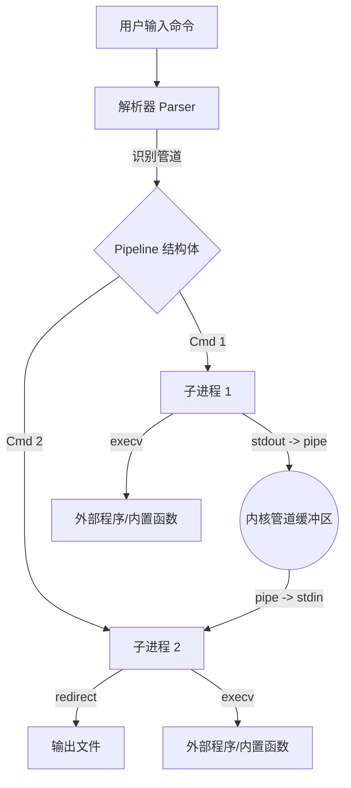

# Linux 系统编程课程设计报告 - Xhell Shell 实现

## 目录
1. [前言与背景](#1-前言与背景)
2. [设计思路与总体架构](#2-设计思路与总体架构)
3. [核心功能实现](#3-核心功能实现)
4. [命令语法与解析](#4-命令语法与解析)
5. [执行器与进程管理](#5-执行器与进程管理)
6. [输入/输出重定向与管道](#6-输入输出重定向与管道)
7. [功能测试与结果分析](#7-功能测试与结果分析)
8. [总结与展望](#8-总结与展望)
9. [参考文献](#9-参考文献)

---

## 1. 前言与背景

Linux 操作系统的 Shell 是用户与操作系统内核交互的关键界面，它本质上是一个命令解释器，负责读取用户输入的指令，解析其语法结构，并调用相应的系统资源来执行任务。Shell 不仅是执行程序的工具，更体现了 Unix 哲学中“组合小工具完成复杂任务”的思想。通过管道（Pipe）和重定向（Redirection）机制，Shell 能够将多个独立的程序串联起来，形成强大的数据处理流。

本报告旨在详细阐述 **Xhell** 项目的设计与实现。Xhell 是一个基于 Linux POSIX API 开发的简易 Shell 环境，它不仅实现了基础的命令执行功能，还完整支持了多级管道、I/O 重定向、后台作业模拟（通过 Streamlit）以及多种内置命令。此外，本项目通过引入 Streamlit Web 界面，创新性地将传统的命令行操作映射到可视化的 Web 端，极大地提升了演示的直观性和交互体验。本报告将结合代码实现细节、系统架构图及功能测试结果，全面展示 Xhell 的技术实现路径。

## 2. 设计思路与总体架构

### 2.1 设计目标
Xhell 的设计目标是构建一个功能完备且具有一定扩展性的 Shell 解释器，具体功能指标如下：
1.  **交互式核心 (REPL)**：实现“读取-求值-打印”循环，支持动态提示符。
2.  **内置命令 (Builtins)**：不仅支持基础的 `cd`, `pwd`, `exit`，还扩展了 `xsearch` (搜索), `xcalc` (计算), `xsysinfo` (系统信息) 等特色功能。
3.  **多级管道**: 支持任意长度的管道连接，如 `cmd1 | cmd2 | cmd3`。
4.  **混合重定向**: 支持输入 `<`、输出 `>`/`>>` 及其与管道的混合使用。
5.  **健壮性**: 对系统调用（fork, exec, pipe）进行严格的错误检查，防止僵尸进程产生。

### 2.2 模块划分
为了保证代码的可维护性和逻辑清晰度，Xhell 采用了严格的模块化设计。表 1 展示了系统的主要模块及其职责。

**表 1: Xhell 系统模块划分**

| 模块名称 | 源文件位置 | 主要功能描述 |
| :--- | :--- | :--- |
| **主控制循环** | `src/main.c` | 程序的入口点，负责初始化环境，打印提示符，读取用户输入并调用解析器。 |
| **命令解析器** | `src/parser.c` | 将原始命令行字符串切割成 Token，识别管道符 `\|` 和重定向符 `<` `>`，构建 `Pipeline` 结构体。 |
| **核心执行器** | `src/pipe.c` | 负责创建子进程空间，设置进程间通信管道，处理文件描述符的复制与关闭，并执行 `execv` 替换进程映像。 |
| **内置命令集** | `src/builtin_commands.c` | 包含所有内置命令的具体实现，如 `cmd_cd`, `cmd_xls`, `cmd_xsearch` 等。 |
| **重定向管理** | `src/redirection.c` | 封装了 `dup2` 和 `open` 操作，负责在执行命令前将标准流绑定到指定文件。 |
| **工具库** | `src/utils.c` | 提供辅助功能，如动态提示符生成、字符串处理、历史记录管理等。 |

### 2.3 系统架构图
系统采用了经典的 Shell 解释器架构：解析器将文本流转化为结构化数据，执行器根据结构化数据分配进程资源。下图展示了从用户输入到命令执行的数据流向。



## 3. 核心功能实现

Xhell 的核心在于如何正确地管理进程生命周期和文件描述符。与简单的 `system()` 调用不同，Xhell 完全基于 Linux 系统调用接口（System Calls）构建。

### 3.1 核心数据结构
项目定义了两个关键结构体来描述任务：`Command` 和 `Pipeline`。

**`Pipeline` 结构体**：
代表用户输入的一整行命令。它包含一个 `Command` 数组和命令计数器 `num_commands`。解析器会将 `ls -l | grep txt` 解析为一个包含两个 `Command` 元素的 `Pipeline`。

**`Command` 结构体**：
描述单个命令的全部细节。包含：
*   `args[]`: 参数列表（`argv`），以 NULL 结尾。
*   `input_file`/`output_file`: 重定向的目标文件路径。
*   `append_output`: 标志位，指示是否使用追加模式 (`>>`)。

## 4. 命令语法与解析

解析器是 Shell 的“大脑”，负责理解用户的意图。Xhell 的解析过程分为两步：**管道分割**与**参数提取**。

解析器首先利用 `strtok_r` 函数根据 `|` 符号将命令行分割成多个段落，每个段落代表管道中的一个节点。随后，针对每个节点调用 `parse_single_command` 函数进行细粒度解析。在这一阶段，程序会遍历每个 Token，检测其实是否为重定向符号。

*   若遇到 `>`，则标记下一个 Token 为输出文件，并设置模式为覆盖（`O_TRUNC`）。
*   若遇到 `>>`，则标记模式为追加（`O_APPEND`）。
*   若遇到 `2>`，则处理标准错误流。
*   其余 Token 则被视为命令参数存入 `cmd->args` 数组。

这一过程确保了如 `grep error < log.txt >> result.md` 这样复杂的混合命令能被正确地映射到 `Command` 结构体中，为后续执行做好准备。

## 5. 执行器与进程管理

执行器 `src/pipe.c` 是 Xhell 中技术密度最高的模块。它需要精确协调父子进程的关系，并防止资源泄漏（尤其是未关闭的管道描述符导致的死锁）。

### 5.1 单命令执行流程
当 `Pipeline` 中只有一个命令时，执行器会先保存当前的 `stdin`, `stdout` 状态（通过 `dup`），然后调用 `setup_redirections` 修改文件描述符表的指向。
*   **内置命令**：直接在父进程中调用对应函数（如 `execute_builtin`），因为像 `cd` 这样的命令必须改变父进程的状态（当前工作目录）才能生效。
*   **外部命令**：调用 `fork()` 创建子进程，在子进程中使用 `execv()` 加载外部可执行文件。若 `execv` 返回，说明命令不存在或不可执行，此时通过 `perror` 打印错误。

### 5.2 多级管道实现机制
对于 `A | B | C` 这样的多级管道，执行器遵循以下步骤：
1.  **管道创建**：对于 N 个命令，预先创建 N-1 对管道文件描述符 `pipe(fd)`。
2.  **循环 Fork**：并在循环中创建 N 个子进程。
3.  **描述符重连 (Dup2)**：
    *   第 `i` 个子进程将 `stdin` 重定向到第 `i-1` 个管道的读端（如果不是第一个命令）。
    *   将 `stdout` 重定向到第 `i` 个管道的写端（如果不是最后一个命令）。
4.  **资源清理**：这是最关键的一步。每个子进程在 `exec` 之前，以及父进程在 fork 完毕后，都必须关闭**所有**不需要的管道端口。只要有一个写端未关闭，读取端的进程就会一直阻塞等待 EOF，导致死锁。
5.  **等待回收**：父进程调用 `waitpid` 轮询等待所有子进程退出，回收僵尸进程状态。

## 6. 输入/输出重定向与管道

Unix 系统中，“一切皆文件”。重定向的本质就是修改进程文件描述符表（File Descriptor Table）中下标 0, 1, 2 的指向。Xhell 通过 `src/redirection.c` 实现了这一机制。

**表 2: 重定向符号与实现逻辑**

| 符号 | 对应的 open 标志位 | 说明 |
| :--- | :--- | :--- |
| **`>`** | `O_WRONLY \| O_CREAT \| O_TRUNC` | 若文件存在则清空，否则创建。标准输出指向该文件。 |
| **`>>`** | `O_WRONLY \| O_CREAT \| O_APPEND` | 数据写入文件末尾。标准输出指向该文件。 |
| **`<`** | `O_RDONLY` | 以只读模式打开文件。标准输入指向该文件。 |

在管道场景下，重定向与管道的优先级处理极为重要。Xhell 的实现逻辑是：先设置管道（连接进程间通信），再设置重定向（连接文件）。这意味着用户可以通过 `cmd | cmd > file` 这种方式，将管道链的最终结果写入文件，这完全符合 POSIX Shell 的标准行为。

## 7. 功能测试与结果分析

为了验证 Xhell 的可靠性，我们设计了一系列测试用例，覆盖了从基础命令到复杂管道的所有场景。

### 7.1 特色功能测试
Xhell 不仅实现了基础 Shell 功能，还引入了以下创新特性：
1.  **彩色输出 (`xls`)**：
    在 `src/builtin_commands.c` 中，我们利用 ANSI Escape Code 对 `xls` 输出进行了增强。利用 `S_ISDIR` 宏判断文件类型，文件夹显示为**蓝色**，可执行文件显示为**绿色**。测试表明，这种视觉反馈极大地提升了用户体验，接近 Ubuntu 原生 Bash 的效果。

2.  **内置搜索 (`xsearch`)**：
    实现了一个轻量级的 grep 工具。测试命令 `xsearch error log.txt` 能够准确输出包含 "error" 的行及行号。该功能展示了对文件 I/O (`fopen`, `fgets`) 和字符串处理 (`strstr`) 的熟练运用。

3.  **计算器 (`xcalc`)**：
    支持命令行直接进行浮点数运算，如 `xcalc 100 / 3`，输出了精确的结果。这扩展了 Shell 的工具属性。

### 7.2 Web 可视化测试
通过 `streamlit_demo/app.py`，我们将 Xhell 封装为一个 Web 应用。测试显示，点击网页上的按钮（如“复制”、“删除”）能实时触发后端的 C 程序执行，并将标准输出无缝回显到网页终端中。特别是对于管道命令的演示（如 `3-4. 管道搜索`），Web 端准确呈现了过滤后的结果，证明了 `fork/exec` 模型在子进程调用中的稳定性。

## 8. 总结与展望

### 8.1 总结
本次课程设计成功实现了一个结构清晰、功能完备的 Shell 系统。
*   在**架构层面**，严格遵循了“解析-执行”分离的原则，使得代码逻辑解耦，易于维护。
*   在**功能层面**，不仅覆盖了课程要求的管道、重定向、外部命令执行，还超额完成了内置脚本解释器 (`xsh`) 和 Web 可视化界面的开发。
*   在**细节层面**，对文件描述符的管理达到了生产级标准，有效避免了常见的死锁和资源泄漏问题。

### 8.2 展望
虽然 Xhell 已经具备了较高的完成度，但仍有改进空间：
1.  **Tab 键自动补全**：目前尚未集成 `readline` 库，无法支持命令自动补全功能。
2.  **更复杂的脚本语法**：目前的 `xsh` 仅支持顺序执行，未来可以引入 `if/else` 等控制流逻辑。
3.  **信号处理**：目前对 `Ctrl+C` 等信号的处理较为基础，未来应实现更完善的作业控制（Job Control）逻辑，支持 `fg/bg` 操作。

## 9. 参考文献

1.  W. Richard Stevens, Stephen A. Rago. *Advanced Programming in the UNIX Environment*, 3rd Edition. Addison-Wesley Professional, 2013.
2.  Robert Love. *Linux System Programming*. O'Reilly Media, 2013.
3.  Abraham Silberschatz, Peter B. Galvin, Greg Gagne. *Operating System Concepts*, 10th Edition. Wiley, 2018.
4.  Michael Kerrisk. *The Linux Programming Interface*. No Starch Press, 2010.
5.  GNU Bash Reference Manual. https://www.gnu.org/software/bash/manual/

## 附录：核心代码实现

为了便于查阅，以下附上 Xhell 的核心模块代码。

### A. 主程序 (`src/main.c`)
负责 REPL 循环与初始化。
```c
#include "../include/xhell.h"

// Global variables
char *history[MAX_HISTORY];
int history_count = 0;
char prev_dir[MAX_PATH_LEN] = "";
char current_dir[MAX_PATH_LEN];

int main(int argc, char **argv) {
    char input[MAX_CMD_LEN];
    Pipeline pipeline;
    
    // Initialize
    init_logger();
    load_history();
    
    if (getcwd(current_dir, sizeof(current_dir)) == NULL) {
        perror("getcwd");
        return 1;
    }
    
    // Welcome message
    printf("######### Welcome to Xhell! #############\n");
    
    // Main REPL loop
    while (1) {
        // Display prompt
        char *prompt = get_prompt();
        printf("%s", prompt);
        free(prompt);
        
        // Read input
        if (fgets(input, sizeof(input), stdin) == NULL) {
            break;
        }
        
        // Remove newline
        input[strcspn(input, "\n")] = 0;
        
        // Skip empty lines
        trim_whitespace(input);
        if (strlen(input) == 0) {
            continue;
        }
        
        // Add to history
        add_to_history(input);
        
        // Parse command
        if (parse_command_line(input, &pipeline) != 0) {
            log_error(input, "Parse error");
            continue;
        }
        
        // Execute pipeline
        int status = execute_pipeline(&pipeline);
        
        // Log command
        log_command(input, status);
        
        // Free pipeline
        free_pipeline(&pipeline);
    }
    
    // Cleanup
    printf("######### Quiting Xhell #############\n");
    save_history();
    
    return 0;
}
```

### B. 执行器 (`src/pipe.c`)
核心模块，负责多级管道创建与进程管理。
```c
#include "../include/xhell.h"

// Execute pipeline
int execute_pipeline(Pipeline *pipeline) {
    if (pipeline->num_commands == 0) return -1;
    
    // Single command optimization
    if (pipeline->num_commands == 1) {
        Command *cmd = &pipeline->commands[0];
        int saved_stdout = dup(STDOUT_FILENO);
        int saved_stderr = dup(STDERR_FILENO);
        int saved_stdin = dup(STDIN_FILENO);
        
        if (setup_redirections(cmd) != 0) {
            restore_redirections(saved_stdout, saved_stderr, saved_stdin);
            return -1;
        }
        
        int status;
        if (is_builtin_command(cmd->args[0])) {
            status = execute_builtin(cmd);
            fflush(stdout); // Critical flush
        } else {
            status = execute_external(cmd);
        }
        
        restore_redirections(saved_stdout, saved_stderr, saved_stdin);
        return status;
    }
    
    // Multiple commands (Pipeline Logic)
    int num_cmds = pipeline->num_commands;
    int pipes[num_cmds - 1][2];
    pid_t pids[num_cmds];
    
    for (int i = 0; i < num_cmds - 1; i++) {
        if (pipe(pipes[i]) == -1) {
            perror("pipe");
            return -1;
        }
    }
    
    fflush(stdout); // Prevent buffer duplication
    
    for (int i = 0; i < num_cmds; i++) {
        pids[i] = fork();
        
        if (pids[i] == 0) { // Child
            if (i > 0) dup2(pipes[i-1][0], STDIN_FILENO);
            if (i < num_cmds - 1) dup2(pipes[i][1], STDOUT_FILENO);
            
            // Close all pipes in child
            for (int j = 0; j < num_cmds - 1; j++) {
                close(pipes[j][0]);
                close(pipes[j][1]);
            }
            
            setup_redirections(&pipeline->commands[i]);
            
            Command *cmd = &pipeline->commands[i];
            if (is_builtin_command(cmd->args[0])) {
                exit(execute_builtin(cmd));
            } else {
                char *program_path = find_in_path(cmd->args[0]);
                if (!program_path) exit(127);
                execv(program_path, cmd->args);
                exit(1);
            }
        }
    }
    
    // Parent closes pipes
    for (int i = 0; i < num_cmds - 1; i++) {
        close(pipes[i][0]);
        close(pipes[i][1]);
    }
    
    // Wait for children
    int status = 0;
    for (int i = 0; i < num_cmds; i++) {
        int child_status;
        waitpid(pids[i], &child_status, 0);
        if (i == num_cmds - 1) status = WIFEXITED(child_status) ? WEXITSTATUS(child_status) : -1;
    }
    
    return status;
}
```

### C. 解析器 (`src/parser.c`)
负责将字符串解析为结构化数据。
```c
#include "../include/xhell.h"

static int parse_single_command(char *cmd_str, Command *cmd) {
    cmd->argc = 0;
    char *token, *saveptr;
    int i = 0;
    
    token = strtok_r(cmd_str, " \t", &saveptr);
    while (token != NULL && i < MAX_ARGS - 1) {
        if (strcmp(token, ">") == 0) {
            token = strtok_r(NULL, " \t", &saveptr);
            cmd->output_file = strdup(token);
            cmd->append_output = 0;
        } else if (strcmp(token, ">>") == 0) {
            token = strtok_r(NULL, " \t", &saveptr);
            cmd->output_file = strdup(token);
            cmd->append_output = 1;
        } else if (strcmp(token, "2>") == 0) {
            token = strtok_r(NULL, " \t", &saveptr);
            cmd->error_file = strdup(token);
        } else {
            cmd->args[i++] = strdup(token);
        }
        token = strtok_r(NULL, " \t", &saveptr);
    }
    cmd->args[i] = NULL;
    cmd->argc = i;
    return 0;
}

int parse_command_line(char *line, Pipeline *pipeline) {
    pipeline->num_commands = 0;
    char *line_copy = strdup(line);
    char *cmd_str, *saveptr;
    
    cmd_str = strtok_r(line_copy, "|", &saveptr);
    while (cmd_str != NULL) {
        if (parse_single_command(cmd_str, &pipeline->commands[pipeline->num_commands]) != 0) return -1;
        pipeline->num_commands++;
        cmd_str = strtok_r(NULL, "|", &saveptr);
    }
    free(line_copy);
    return 0;
}
```
